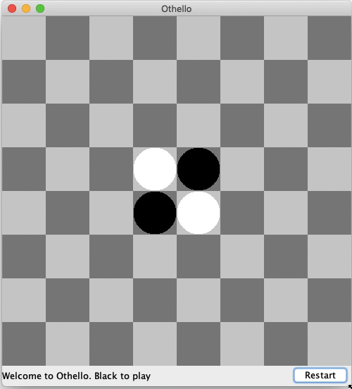

# Othello Game ⚫⚪

This is a GUI implementation of the strategy board game **Othello** (a variant of Reversi).
- Built with the **Java Programming Language**
- User Interface built using **Java Swing GUI Toolkit**

## Key Features

- Correctly flips appropriate pieces based on Othello game rules
- Ensures only valid moves can be played
- Highlights Grid Spots that would make valid moves for the User
- Checks and outputs who the winner of the game is
- Allows for 2 players to play

## Demo 

